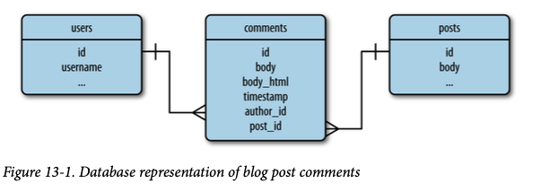

# Comentarios de usuario

## Representación de los comentarios en la base de datos

En la siguiente imagen se muestra el diagrama de entidad-relación para los comentarios.



- Los comentarios se aplican a entradas específicas del blog, por lo que se define una relación de uno-a-muchos a partir de la tabla `posts`.
- La tabla `comments` también tiene una relación de uno-a-muchos con la tabla `users`.

La definición del modelo `Comment` se muestra a continuación:

```python
# app/models.py
class Comment(db.Model):
    __tablename__ = 'comments'
    id = db.Column(db.Integer, primary_key=True)
    body = db.Column(db.Text)
    body_html = db.Column(db.Text)
    timestamp = db.Column(db.DateTime, index=True, default=datetime.utcnow)
    disabled = db.Column(db.Boolean)
    author_id = db.Column(db.Integer, db.ForeignKey('users.id'))
    post_id = db.Column(db.Integer, db.ForeignKey('posts.id'))

    @staticmethod
    def on_changed_body(target, value, oldvalue, initiator):
        allowed_tags = ['a', 'abbr', 'acronym', 'b', 'code', 'em', 'i',
                        'strong']
        target.body_html = bleach.linkify(bleach.clean(
            markdown(value, output_format='html'),
            tags=allowed_tags, strip=True))

db.event.listen(Comment.body, 'set', Comment.on_changed_body)
```
- `disabled` es un booleano que utilizarán los moderadores para suprimir los comentarios inapropiados u ofensivos.
- Los comentarios definen un evento que se activa cada vez que cambia el campo del cuerpo, lo que automatiza la conversión del texto Markdown a HTML.

Los modelos `User` y `Post` deben definir las relaciones uno-a-muchos con la tabla `comments`:
```python
# app/models.py
class User(db.Model): 
    # ...
    comments = db.relationship('Comment', backref='author', lazy='dynamic')

class Post(db.Model):
    # ...
    comments = db.relationship('Comment', backref='post', lazy='dynamic')
```

## Envío y visualización de comentarios

Se crea el formulario web para la entrada de comentarios.
```python
# app/main/forms
class CommentForm(FlaskForm):
    body = StringField('Enter your comment', validators=[DataRequired()])
    submit = SubmitField('Submit')
```
```python
# app/main/views.py
@main.route('/post/<int:id>', methods=['GET', 'POST'])
def post(id):
    post = Post.query.get_or_404(id)
    form = CommentForm()
    if form.validate_on_submit():
        comment = Comment(body=form.body.data,
                        post=post,
                        author=current_user._get_current_object())
        db.session.add(comment)
        db.session.commit()
        flash('Your comment has been published.')
        return redirect(url_for('.post', id=post.id, page=-1))
    page = request.args.get('page', 1, type=int)
    if page == -1:
        page = (post.comments.count() - 1) // \
                current_app.config['FLASKY_COMMENTS_PER_PAGE'] + 1
    pagination = post.comments.order_by(Comment.timestamp.asc()).paginate(
            page=page, per_page=current_app.config['FLASKY_COMMENTS_PER_PAGE'],
            error_out=False)
    comments = pagination.items
    return render_template('post.html', posts=[post], form=form,
                            comments=comments, pagination=pagination)
```
- El autor del comentario no puede establecerse directamente a `current_user` porque éste es un objeto proxy de variable de contexto. La expresión `current_user._get_current_object()` devuelve el objeto `User` real.
- Cuando el número de página se obtiene de la cadena de consulta y resulta ser -1, se realiza un cálculo con el número de comentarios y el tamaño de la página para obtener el número de página real que se debe utilizar.
- La variable de configuración `FLASKY_COMMENTS_PER_PAGE` se añade a *config.py* para controlar el tamaño de cada página de comentarios.

También es interesante la estructura del enlace a la página de comentarios, que se construye como el enlace permanente de la entrada con un sufijo `#comments` añadido. Esta última parte se denomina **fragmento de URL** y se utiliza para indicar una posición inicial de desplazamiento para la página. 

## Moderación de comentarios

La moderación de comentarios solo puede ser realizada por usuarios con permisos `MODERATE`. Esta función se expondrá como un enlace en la barra de navegación que sólo aparecerá para los usuarios autorizados, esto se hace desde plantilla *base.html*.
```html
<!-- app/templates/base.html -->
...

<li><a href="{{ url_for('main.moderate') }}">Moderate Comments</a></li>

...
```

Esta página muestra los comentarios ordenador del más reciente al más antiguo. Se muestran con un botón para habilitarlos/deshabilitarlos con el atributo `disabled`.
```python
# app/main/views.py
@main.route('/moderate')
@login_required
@permission_required(Permission.MODERATE)
def moderate():
    page = request.args.get('page', 1, type=int)
    pagination = Comment.query.order_by(Comment.timestamp.desc()).paginate(
        page=page, per_page=current_app.config['FLASKY_COMMENTS_PER_PAGE'],
        error_out=False)
    comments = pagination.items
    return render_template('moderate.html', comments=comments,
                            pagination=pagination, page=page)
```

La plantilla *moderate.html* es muy parecida a *_comments.html*.
```html
<!-- app/templates/moderate.html -->



Flasky - Comment Moderation


<div class="page-header">
    <h1>Comment Moderation</h1>
</div>



<div class="pagination">
    {{ macros.pagination_widget(pagination, '.moderate') }}
</div>


```
- Se utiliza la `set` de Jinja2 para definir una variable de plantilla `moderate` con el valor `True`, la cual es usada por la plantilla *_comments.html* para determinar si las características de moderación necesitan ser ren- deradas.

```html
<!-- app/templates/_comments.html -->
...
<div class="comment-body">
    
    <p><i>This comment has been disabled by a moderator.</i></p>
    
    
        
            {{ comment.body_html | safe }}
        
            {{ comment.body }}
        
    
</div>

    <br>
    
    <a class="btn btn-default btn-xs" href="{{ url_for('.moderate_enable', id=comment.id, page=page) }}">Enable</a>
    
    <a class="btn btn-danger btn-xs" href="{{ url_for('.moderate_disable', id=comment.id, page=page) }}">Disable</a>
    

...
```

Los moderadores verán tanto el aviso como el cuerpo del comentario. Los moderadores también verán un botón para cambiar el estado de desactivación debajo de cada comentario. El botón invoca uno de las dos nuevas rutas:
```python
# app/main/views.py
@main.route('/moderate/enable/<int:id>')
@login_required
@permission_required(Permission.MODERATE)
def moderate_enable(id):
    comment = Comment.query.get_or_404(id)
    comment.disabled = False
    db.session.add(comment)
    db.session.commit()
    return redirect(url_for('.moderate',
                            page=request.args.get('page', 1, type=int)))


@main.route('/moderate/disable/<int:id>')
@login_required
@permission_required(Permission.MODERATE)
def moderate_disable(id):
    comment = Comment.query.get_or_404(id)
    comment.disabled = True
    db.session.add(comment)
    db.session.commit()
    return redirect(url_for('.moderate',
                            page=request.args.get('page', 1, type=int)))
```
- Las rutas de activación y desactivación  cargan el objeto de comentario, establecen el campo `disabled` en el valor adecuado y lo vuelven a escribir en la base de datos.
- Se redirigen de nuevo a la página de moderación de comentarios


